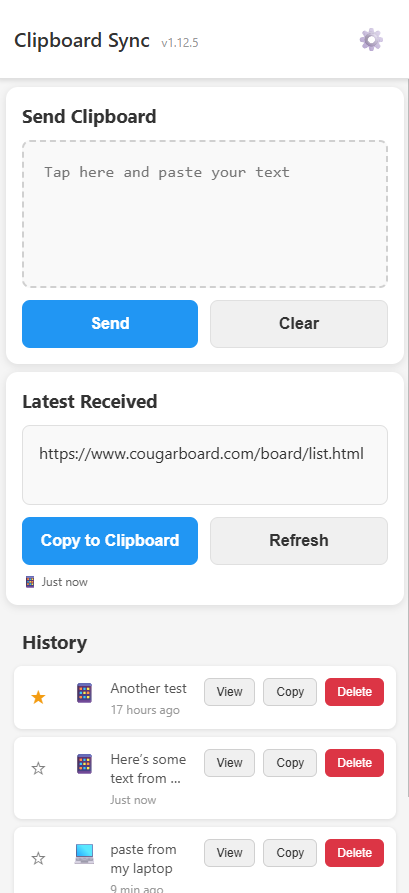

# Clip Sync

A simple, secure clipboard syncing tool that works across all your devices - no server required!

**🔒 Your data stays private:** Everything runs in your browser and syncs to YOUR personal storage (Pantry Cloud or GitHub Gist). No one else can see your clipboard data - not even us!

**Try it now:** [https://www.cabird.com/clip_sync](https://www.cabird.com/clip_sync)

## What is Clip Sync?

Clip Sync lets you easily copy text on one device and paste it on another. Whether you're moving text from your phone to your laptop or vice versa, Clip Sync makes it seamless.

### Key Features

- 📱 **Cross-Platform** - Works on iPhone, Android, Windows, Mac, and Linux
- 🔒 **Secure** - Your data is private (stored in Pantry Cloud or GitHub)
- 🚀 **No Server Needed** - Runs entirely in your browser
- 📌 **Pin Important Items** - Keep frequently used text at the top
- 👁️ **View Full Content** - See complete text with formatting preserved
- 📅 **History** - Stores your last 20 clipboard items
- 🔄 **Auto-Sync** - Automatically checks for new items at customizable intervals
- 🗑️ **Delete Items** - Remove sensitive information from your history
- 💻 **Device Detection** - Shows whether text came from phone (📱) or computer (💻)
- ⚡ **Works Offline** - View your clipboard history even without internet
- 🔗 **QR Code Sharing** - Easy device pairing with QR codes (Pantry mode)

## How It Works

Clip Sync now supports two storage backends:

### 1. Pantry Cloud (Default - Easier!)
- No GitHub account needed
- Just need an email to get started
- Share your Pantry ID between devices using QR codes
- Free with generous limits

### 2. GitHub Gist (Original)
- Uses your own GitHub account
- Requires a Personal Access Token
- Data stored in a private Gist
- Completely free

## Getting Started

### Option 1: Pantry Cloud (Recommended - Easier!)

**First Device Setup:**
1. Visit [https://www.cabird.com/clip_sync](https://www.cabird.com/clip_sync)
2. The app will default to Pantry Cloud storage
3. Click the settings icon (⚙️)
4. Click the help icon next to "Pantry ID" for instructions
5. Go to [https://getpantry.cloud](https://getpantry.cloud) and enter your email
6. Name your pantry (anything works - like "my-clipboard" or just your name)
7. Copy the Pantry ID you receive (looks like: 12a34567-8901-2345-b678-9ce0123456e7)
8. **Important:** Save this ID somewhere safe (password manager, notes, etc.) - you only need to get it once!
9. Paste it in Clip Sync and click "Save & Connect"

**Adding Other Devices:**
- **Easy way:** In settings, click "Share as QR Code" and scan it from the app on your other device
- **Manual way:** Enter the same Pantry ID on each device

### Option 2: GitHub Gist (Original Method)

#### 1. Get a GitHub Personal Access Token

1. Sign in to [GitHub.com](https://github.com)
2. Click your profile picture → **Settings**
3. Scroll to bottom → **Developer settings**
4. Click **Personal access tokens** → **Tokens (classic)**
5. Click **Generate new token** → **Generate new token (classic)**
6. Name it "Clipboard Sync"
7. Set expiration (or choose "No expiration")
8. Check ONLY the `gist` checkbox
9. Click **Generate token**
10. **Copy the token immediately!** (You won't see it again)

#### 2. Set Up Clip Sync with GitHub

1. Visit [https://www.cabird.com/clip_sync](https://www.cabird.com/clip_sync)
2. Click the settings icon (⚙️)
3. Change "Storage Backend" to "GitHub Gist"
4. Paste your GitHub token
5. Click "Save & Connect"
6. The app will create a private gist automatically

#### 3. Use the Same Token on All Devices

To sync between devices, simply enter the same GitHub token on each device. The app will automatically find your clipboard gist.

## Installation Guide

### Install on iPhone/iPad

1. Open Safari and go to [https://www.cabird.com/clip_sync](https://www.cabird.com/clip_sync)
2. Tap the Share button (square with arrow)
3. Scroll down and tap "Add to Home Screen"
4. Name it "Clip Sync" and tap "Add"
5. The app icon will appear on your home screen

### Install on Android

1. Open Chrome and go to [https://www.cabird.com/clip_sync](https://www.cabird.com/clip_sync)
2. Tap the menu (three dots)
3. Tap "Add to Home screen"
4. Name it "Clip Sync" and tap "Add"
5. The app icon will appear on your home screen

### Install on Windows/Mac/Linux

#### Chrome/Edge:
1. Visit [https://www.cabird.com/clip_sync](https://www.cabird.com/clip_sync)
2. Click the install icon in the address bar (or menu → "Install Clip Sync")
3. Click "Install"
4. The app will open in its own window
5. Pin it to your taskbar/dock for easy access

#### Firefox:
Firefox doesn't support PWA installation, but you can:
1. Bookmark the page
2. Add it to your bookmarks toolbar for quick access

## Using Clip Sync

### Send Text
1. Copy text from any app
2. Open Clip Sync
3. Tap the paste area and paste your text
4. Tap "Send"

### Receive Text
1. Open Clip Sync on your other device
2. The latest text appears automatically
3. Tap "Copy to Clipboard"
4. Paste anywhere you need it

### Features

- **Pin Items**: Click the star (☆) to pin important items to the top
- **View Full**: Click "View" to see the complete text with formatting
- **History**: See your last 20 clipboard items
- **Auto-Sync**: Enable automatic syncing in settings
  - Choose between 15s (fast), 30s (default), or 60s (battery saver)
  - See a blue pulsing indicator when auto-sync is active
  - View the last sync time in settings
- **Delete Items**: Click the red "Delete" button to remove sensitive items
  - Confirmation dialog shows first 50 characters
  - Permanently removes from all devices
- **Manual Refresh**: Click refresh to immediately check for new items
- **QR Code Sharing** (Pantry mode only):
  - Generate QR code to share your Pantry ID
  - Scan QR code to quickly set up on new devices

## Privacy & Security

### Pantry Cloud Storage
- Your data is accessible only with your unique Pantry ID
- The Pantry ID is stored locally on your device
- Data is stored in Pantry's cloud infrastructure
- You control who has access by sharing (or not sharing) your Pantry ID

### GitHub Gist Storage
- Your clipboard data is stored in a private GitHub Gist
- Only accessible with your personal access token
- The token is stored locally on your device (never sent anywhere else)
- No third-party can see your clipboard data
- You can revoke access anytime by deleting the token in GitHub

## Tips

- **For Pantry users**: 
  - You only need to get your Pantry ID once from getpantry.cloud
  - Save it somewhere safe (notes, password manager) in case your browser storage is cleared
  - Use the QR code feature to quickly add new devices - no typing needed!
- **For GitHub users**: Save your GitHub token in a password manager
- The app works best when installed as a PWA (see installation guides above)
- Pinned items (⭐) stay at the top of your history
- Enable auto-sync for hands-free operation - new items appear automatically
- Use the delete button to remove sensitive information you don't want to keep
- Set auto-sync to 60 seconds on mobile devices to save battery

## Troubleshooting

**Can't see new items?**
- If auto-sync is off, click the Refresh button
- Enable auto-sync in settings for automatic updates
- **Pantry users**: Make sure you're using the same Pantry ID on all devices
- **GitHub users**: Make sure you're using the same GitHub token on all devices
- Note: There may be a slight delay (5-60 seconds) due to caching

**Installation issues?**
- Clear your browser cache
- Try uninstalling and reinstalling
- Make sure you're using a supported browser

**Pantry ID not working?**
- Double-check you copied the complete ID (should look like: 12a34567-8901-2345-b678-9ce0123456e7)
- Make sure there are no extra spaces
- Try getting a new Pantry ID from [getpantry.cloud](https://getpantry.cloud)

**GitHub token not working?**
- Make sure the token has `gist` permission
- Check that you copied the entire token
- Try generating a new token

## Browser Support

- ✅ Chrome/Edge (Full PWA support)
- ✅ Safari (iOS PWA support)
- ✅ Firefox (No PWA, but fully functional)
- ✅ Most modern mobile browsers

## Open Source

This project is open source! Check out the code at [github.com/cabird/clip_sync](https://github.com/cabird/clip_sync)

---

Made with ❤️ for anyone tired of emailing themselves text